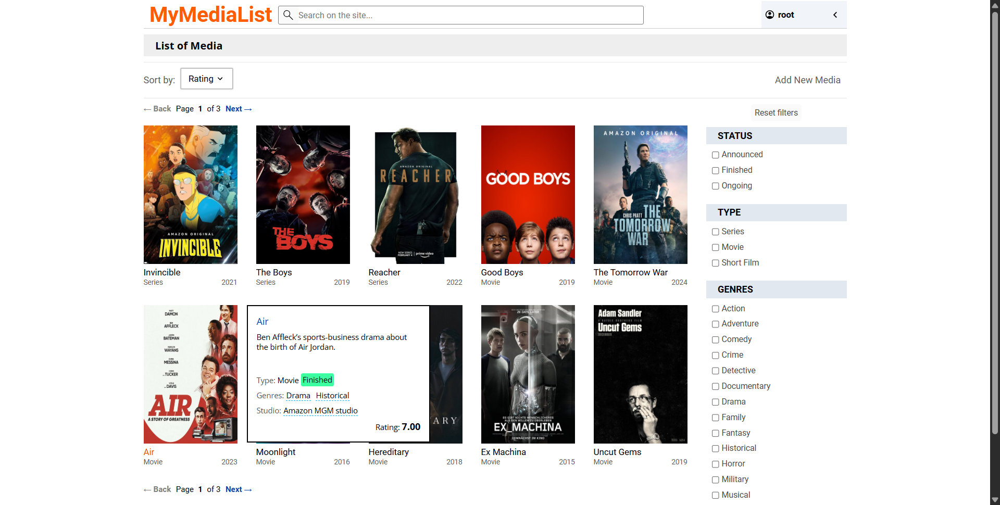
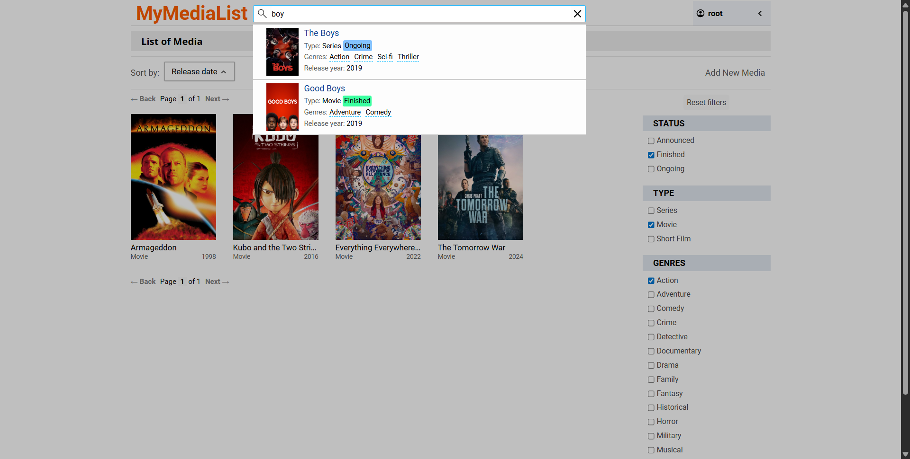
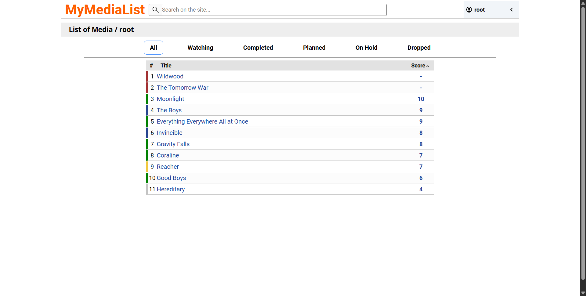
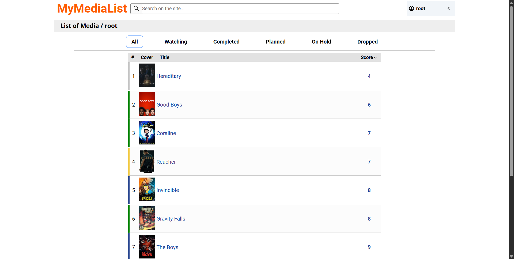
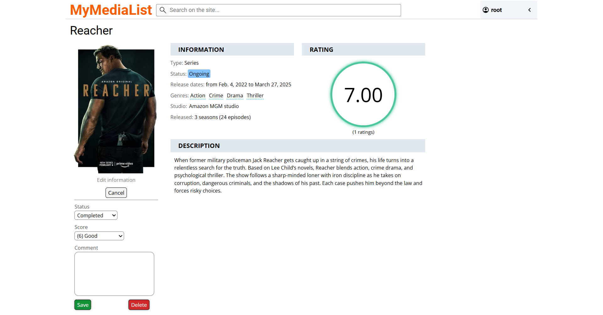
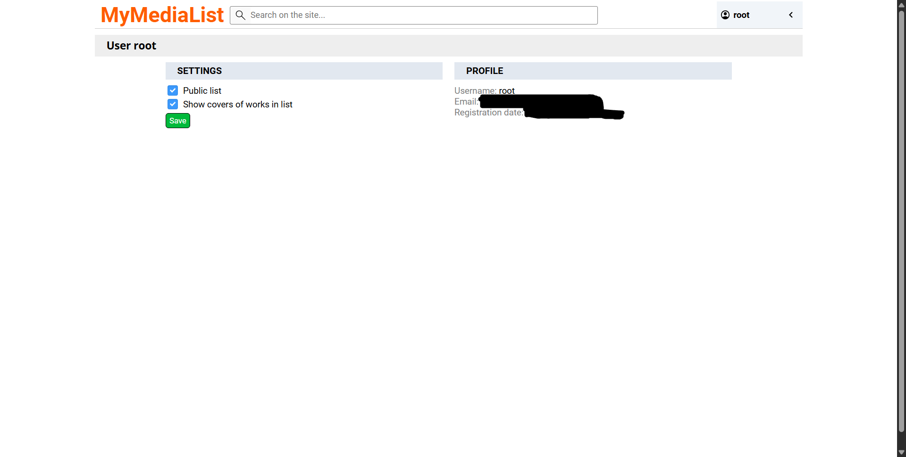

# MyMediaList

A web app for cataloging and tracking media like shows, films, or anything else. Users can keep personal lists, add comments, set a status such as planned, watching, completed, or dropped, and give scores. Lists can be shared publicly or kept private. Users can also propose new titles or edits to existing ones, with changes moderated by admins.

## Tech Stack

| Area           | Technologies                                            |
| -------------- | ------------------------------------------------------- |
| Frontend       | Django Templates                                        |
| Backend        | Django 5.1, Celery 5.4                                  |
| Database       | MySQL 8, Redis 7                                        |
| Infrastructure | Docker, Docker Compose, Nginx                           |

## Screenshots

<p align="center">
  
  
  
</p>

<p align="center">
  
  
  
</p>

## Quick Start (Local)

### Docker
1) Run docker:
```bash
docker compose -f docker-compose.dev.yml up --build
```
2) Create superuser and load fixtures:

```bash
docker exec -it mml_django python manage.py createsuperuser
docker exec -it mml_django python manage.py loaddata fixtures/static_data.json fixtures/examples.json
```

3) Open http://localhost:8000

## Production Deployment

### Deployment
1) Create and edit `.env.prod` (example: .env.example)
2) Edit `nginx/default.conf`
3) Run docker:
```bash
docker compose up -d --build
```
4) Get ssl certificates:
```bash
   docker compose run --rm certbot certonly --webroot \
     --webroot-path=/var/www/certbot \
     --email <email> --agree-tos --no-eff-email \
     -d <domain> -d <...>
```
5) Restart nginx container:
```bash
   docker compose restart nginx
```
6) Create superuser and load fixtures:

```bash
docker exec -it mml_django python manage.py createsuperuser
docker exec -it mml_django python manage.py loaddata fixtures/static_data.json fixtures/examples.json
```


### Certificate renew

```bash
docker compose run --rm certbot renew --webroot -w /var/www/certbot --quiet && docker kill -s HUP mml_nginx
```

## License

This project is licensed under the [MIT License](LICENSE.md).
